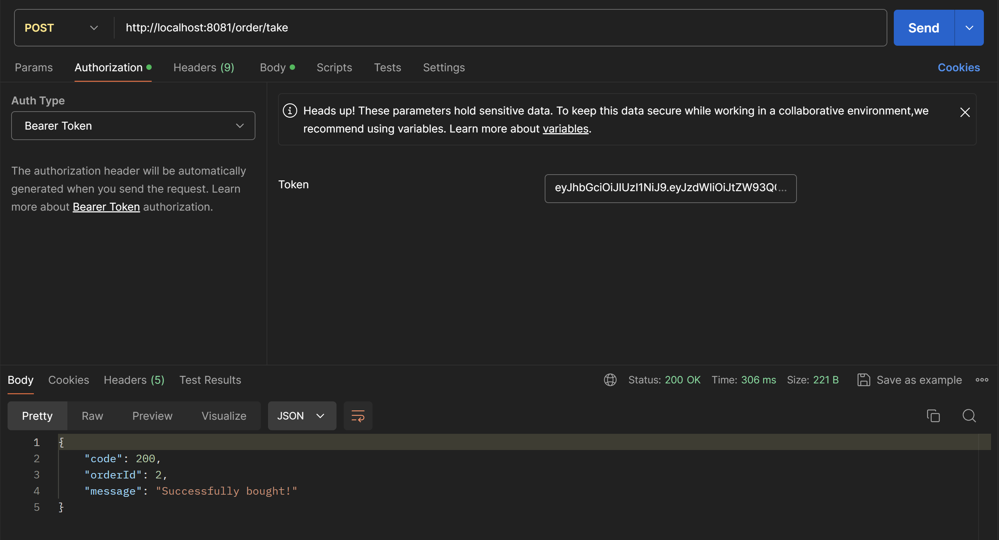

## Тут я (в третий раз) объясню, почему мой код ~~не говно~~ работает отлично!
### Работу выполнил: Кулишенко Макар Андреевич, БПИ226

Добро пожаловать в систему покупки билетов, состоящую из двух микросервисов!

Как запускать проект?

- в проекте есть файл docker-compose.yml, в котором содержатся данные для сборки контейнеров баз данных и серверво обоих микросервисов.

- для запуска необходимо выполнить docker-compose up в терминале или нажать на двойную стрелочку в самом файле.

### Микросервис авторизации

>Микросервис авторизации - проект на Spring Boot, поддерживающий архитектуру MVC. Он использует такие технологии, как Spring Security для авторизации, и Spring Data JPA для работы с репозиторием как с базой данных. В качестве диалекта используется PostreSQL. 

Чтобы получить подробную документацию, необходимо запустить проект и в браузере выполнить запрос:
```
http://localhost:8080/swagger-ui/index.html
```
Swagger предоставит подробную информацию про все эндпоинты. 

**Но**: так как я самый умный и использую Spring Security, swagger без аутентификации не даст никакой информации :)

Посмотрим на структуру проекта (packages):
- **auth**: содержит сервис для регистрации и аутентификации пользователей. 
- **controller**: содержит основные контроллеры (/user): регистрация (signup), аутентификация (login) и получение информации о пользователе по токену (info)
- **dto**: каждый эндпоинт принимает и возвращает определенный тип данных - он обозначается как data transfer object. Все dto, которые поступают в теле запроса находятся в папке *request*, для ответа - в *response*. Например, при регистрации пользователю надо передать в теле POST-запроса никнейм, почту и пароль. Все это удобно принять в виде дата-класса:
```Kotlin
data class UserRequest (
    var nickname: String,
    var email: String,
    var password: String,
)
```
- **entity**: каждую из таблиц в базе данных Spring генерирует из entity. Всего в данном проекте их две - *user* и *session*. Например, сущность пользователя выглядит так: (слово user является зарезервированным, поэтому ого надо обернуть в кавычки)
```Kotlin
@Entity(name="\"user\"")
data class User(
    @Id
    @GeneratedValue(strategy = GenerationType.IDENTITY)
    val id: Long = 0,

    @Column(nullable = false)
    var nickname: String,

    @Column(nullable = false, unique = true)
    var email: String,

    @Column(nullable = false)
    var password: String,

    @Column(columnDefinition = "TIMESTAMP")
    val created: LocalDateTime = LocalDateTime.now()
)
```
- **func**: содержит файл с функциями для валидации (проверка на корректность) пароля и электронной почты
- **jwt**: самый серьезный package проекта - содержит сервис и фильтр запросов для реализации Spring Security. Сервис генерирует токены, проверяет их на валидность, а фильтр не позволяет не авторизованным пользователям совершать запросы по чему-то, кроме /user/signup и /user/login
- **repository**: содержит репозиторий для юзера и сессии.
- **service**: содержит сервисы, использующие выше упомянутые репозитории.

Также в проекте есть файл для запуска приложения и конфигурационный класс для Spring Security.

#### Как работает?

- Изначально база данных проекта пустая. При запуске Spring-приложения создается 2 таблицы. Для добавления в них данных о пользователе и сессии необходимо кого-то зарегистрировать. 

- В Postman-коллекции, которой я любезно поделился, есть примеры запросов с телом для регистрации и аутентификации.

- Пользователь регистрируется в системе, посылая POST-запрос с данными на контроллер ```..localhost:8080/user/signup```. В теле указывается никнейм, почта и пароль. Почта обязательно должна быть уникальной, иначе пользователь получит сообщение о том, что такой юзер уже существует.

- В ответ пользователь получает сообщение об успешном/неуспешном выполнении и токен, который потом будет необходимо передавать в заголовке authorization при запросах на второй микросервис.

- Если пользователь уже есть в системе, ему необходимо выполнить запрос, содержащий почту и пароль, на эндпоинт ```..localhost:8080/user/login```. В ответ пользователь получит bearer token, который будет необходимо указывать в хэдере авторизации при выполнении запросов ко 2 микросервису. Токены соответствуют стандарту Jwt (имеют заголовок, тело, и подпись). Созданием и дешифрацией занимается JwtService.

Посмотрим, как это работает:

1. Регистрация


2. Регистрация с некорректной почтой


3. Залогинимся


Заметим, что вернулся тот же токен, что и при регистрации. То есть, пока токен не истечет, новый не будет создан.

4. Можно еще посмотреть информацию о пользователе (запрос, который выполняет второй микросервис на эндпоинт первого)


### Микросервис покупки билетов

>Микросервис покупки билетов - проект на Spring Boot, поддерживающий архитектуру MVC. Он использует также Spring Security для авторизации, и Spring Data JPA для работы с репозиторием как с базой данных. В качестве диалекта используется PostreSQL. 

Чтобы получить подробную документацию, необходимо в браузере выполнить запрос:
```
http://localhost:8081/swagger-ui/index.html
```
Swagger предоставит подробную информацию про все эндпоинты.

Архитектура проекта также подчиняется MVC, структура во многом совпдает с первым микросервисом, при этом она даже проще (только сервисы, контроллеры, репозитории, сущности и dto). 

#### Как это работает?

- При запуске Spring-приложения создается 2 таблицы.Таблица с заказами пустая (по понятным причинам), а вот в таблице станций я создаю 5 станций в конструкторе сервиса.  

- Сделать заказ может только авторизованный через первый микросервис и получивший токен пользователь.

- Для совершения заказа необходимо выполнить POST-запрос на эндпоинт второго микросервиса ```..localhost:8081/order/take``` и в теле запроса укзать идентификаторы пункта отправления и пункта назначения. 

- **Важно**: для того, чтобы отправить любой запрос на второй микросервис, необходимо указать в хэдэре авторизации bearer token, который вернет первый микросервис. Без него пользователю вернется сообщение о том, что он не авторизован. 

- После того, как запрос на создание заказа отправлен, пользователю вернется сообщение (успешно/неудачно) и идентификатор заказа, по которому можно будет отследить его статус.

- Для того, чтобы проверить статус заказа, необходимо выполнить POST-запрос на эндпоинт ```..localhost:8081/order/status``` и в теле указать айди заказа, который вернулся при оформлении. Снова надо обязательно передать токен.

- Статус заказа 1 (принято) может измениться. Для этого был создан специальный сервис, который каждые 10 секунд вытаскивает из базы данных случайных заказ, статус которого равен 1, и меняет его на 2 или 3.

#### Как сервис определяет по токену, авторизован пользователь или нет?

- При получении любого запроса сервис обработки заказов отправляет запрос певрому микросервису на третий эндпоинт, который возвращает информацию о том, существует ли такой токен и валиден ли он (если токен просрочен, то вернется соответствующая информация).

- Второй микросервис получает ответ, извлекает из него статус (200 - ок, остальное - плохо) и в зависимости от этого выполняет действия дальше или возвращает пользователю ответ с ошибкой и сообщением.

- Для отправки запросов была использована WebClient из Spring React. 

Посмотрим, как это работает:

1. Создадим заказ (возьмем токен, из запроса регистрации выше)



Пример тела запроса:

```
{
   "idStart": 1,
   "idEnd" : 2
}
```
При составлении заказа происходит проверка существования пунктов, откуда и куда хочет отправиться пользователь. Если таких пунктов нет (хотя бы одного), пользователь получит соотв. сообщение.

2. Испортим токен (удалим пару символов)


3. Отследим статус заказа:


Пример тела запроса:

```
{
    "id" : 2
}
```

Статус заказа поменялся на 2.

4. Попробуем несуществующий токен:


Также если какой-то пользователь попытается узнать статус не своего заказа, он получит сообщение, что данный заказ ему не принадлежит.

На этом наш краткий обзор все, спасибо за внимание!